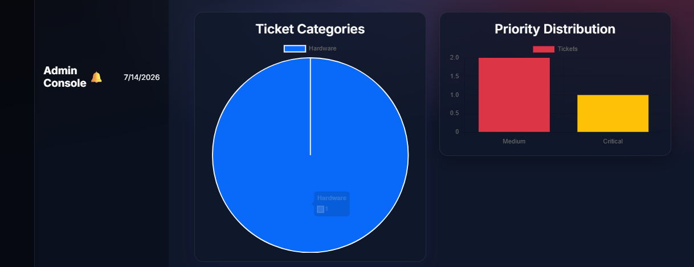
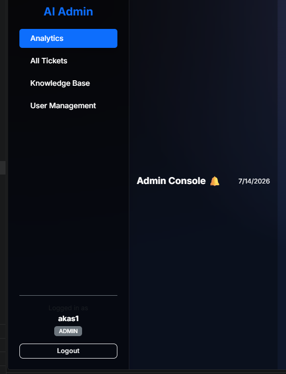
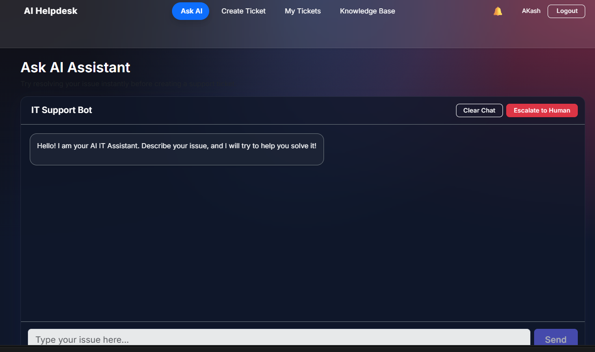
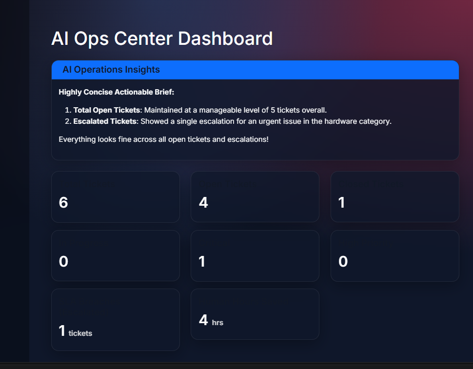
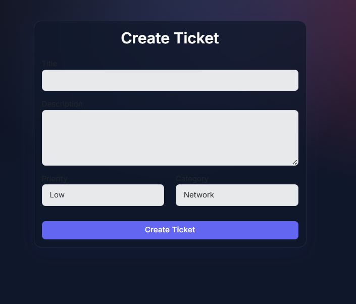
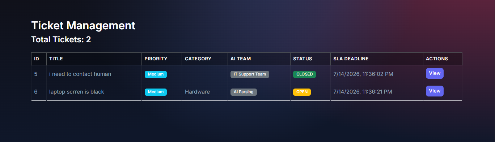
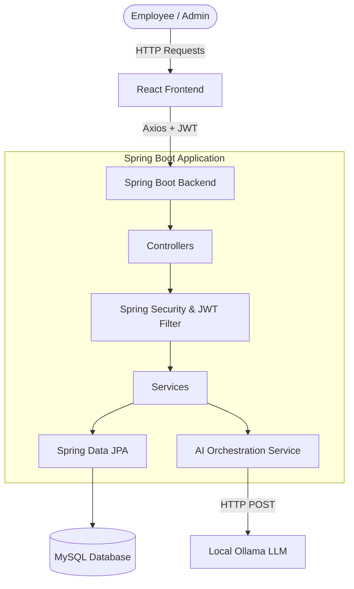

# 🤖 Enterprise-style AI Support Automation Platform


> AI-powered Enterprise IT Helpdesk built with Spring Boot, React, MySQL, JWT Authentication and Local LLM (Ollama). Automates ticket triaging, AI chat assistance, sentiment analysis, intelligent routing, AI Copilot, and Knowledge Base generation.

---

## 📸 Screenshots

### Login & Dashboards



### Core AI Features



### Ticketing & Knowledge Base



---

## 🏗️ System Architecture



---

## 🚀 Features

- **Dual-Portal Architecture**: Distinct workflows for Employees (Ask AI, Ticket Creation, KB access) and Admins (Analytics Dashboard, Global Ticket Management, User Management).
- **Conversational AI Assistant**: Tier-1 AI Agent that greets users, verifies credentials contextually, and attempts to resolve issues before they are escalated to human support.
- **Autonomous Dispatching**: Uses AI JSON-schema parsing to automatically categorize, prioritize, and assign incoming tickets to the correct support teams.
- **Role-Based Access Control (RBAC)**: Secure Spring Security integration with JWT authentication.
- **Real-time AI Ops Dashboard**: Admin analytics featuring real-time insights generated by the AI analyzing current ticket volumes and bottlenecks.
- **Premium Dark-Mode UI**: Built with React, Vite, and custom CSS glassmorphism for a sleek, modern, and translucent aesthetic.

---

## 📂 Folder Structure

```text
├── backend/                              # Spring Boot Application
│   ├── src/main/java/com/akash/.../      # Controllers, Services, Models, Security
│   └── src/main/resources/               # application.properties
├── frontend/                             # React + Vite Application
│   ├── src/components/                   # Reusable UI components
│   ├── src/layouts/                      # Dual-Portal Layouts
│   ├── src/pages/                        # Main Application Views
│   └── src/api/                          # Axios interceptors
├── Architecture_And_Design_Document.md   # In-depth design decisions and fault-tolerance
└── README.md
```

---

## 🔌 API Documentation

| Method | Endpoint                   | Purpose                          | Role Required |
| ------ | -------------------------- | -------------------------------- | ------------- |
| POST   | `/api/auth/login`          | Authenticate user & get JWT      | Public        |
| POST   | `/api/tickets`             | Create a new IT Support Ticket   | EMPLOYEE      |
| GET    | `/api/tickets`             | Get all tickets (filtered by ID) | ALL           |
| POST   | `/api/ai/chat`             | Interact with the AI Assistant   | ALL           |
| GET    | `/api/ai/dashboard-insights`| Generate AI analytics report    | ADMIN         |
| POST   | `/api/tickets/{id}/assign` | Assign ticket to a specific team | ADMIN         |

---

## 🔧 Installation & Setup

### Prerequisites
- JDK 17+
- Node.js 18+
- MySQL Server
- [Ollama](https://ollama.com/) installed and running locally

### 1. Database Setup
```sql
CREATE DATABASE ai_support_db;
```
Configure your credentials in `backend/src/main/resources/application.properties`:
```properties
spring.datasource.url=jdbc:mysql://localhost:3306/ai_support_db
spring.datasource.username=root
spring.datasource.password=your_password
```

### 2. Backend Setup
```bash
cd backend
./mvnw clean spring-boot:run
```

### 3. Frontend Setup
```bash
cd frontend
npm install
npm run dev
```

### 4. AI Engine Setup
```bash
ollama run qwen2.5:1.5b
```

---

## 🔮 Future Enhancements
This project is built with scalability in mind. Future roadmap items include:
- Email Notifications (SMTP integration)
- WebSockets for real-time chat and ticket updates
- Docker & Kubernetes containerization for deployment
- Redis Caching for dashboard analytics
- RAG (Retrieval-Augmented Generation) & Vector Database integration for the Knowledge Base

## 📄 License
This project is licensed under the MIT License - see the [LICENSE](LICENSE) file for details.
